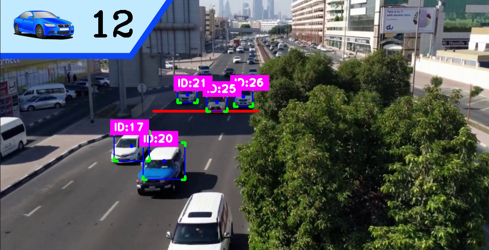

# Computer Vision Detection and Tracking Projects

This repository contains three introductory projects that utilize computer vision techniques for the detection, classification, and tracking of various entities. These projects leverage OpenCV, YOLO (You Only Look Once), and other computer vision libraries to perform real-time analysis in different scenarios.

## General Information

Each project is designed to showcase different capabilities of computer vision technologies:
- **Project 1**: Object detection and tracking to count cars within a specified region of interest.
- **Project 2**: Similar to Project 1 but tailored for counting people in different scenarios.
- **Project 3**: Utilizes a retrained YOLOv8 model on a new dataset for detecting and classifying safety equipment.

---

## Project 1: Car Counter

**Objective**: Utilize detection and classification techniques to count cars in a predetermined region of interest using a mask. The project includes tracking each car by ID to differentiate between new and counted vehicles.

**Techniques Used**:
- Object Detection with YOLO
- Object Tracking with SORT algorithm
- Image Masking to focus on specific areas

**Results**:

  

---

## Project 2: People Counter

**Objective**: Using a similar approach as Project 1, this project is designed to count people in a shopping mall escalator.

**Techniques Used**:
- Object Detection with YOLO
- Object Tracking with SORT algorithm
- Dynamic region of interest for varying environments

**Results**:

  

---

## Project 3: Safety Equipment Detection

**Objective**: Leverage a retrained YOLOv8 model on a specialized dataset for the detection and classification of safety equipment in industrial settings.

**Techniques Used**:
- Advanced Object Detection with a custom-trained YOLOv8 model
- Real-time image processing for safety compliance monitoring

**Results**:

  

